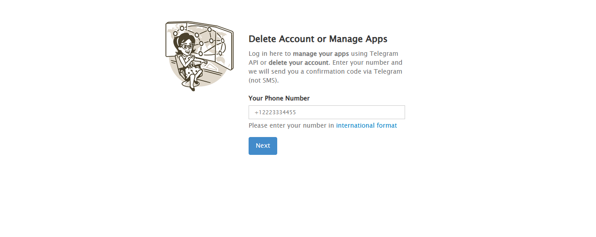
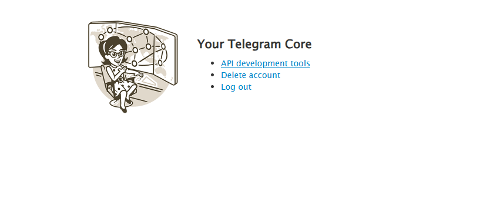
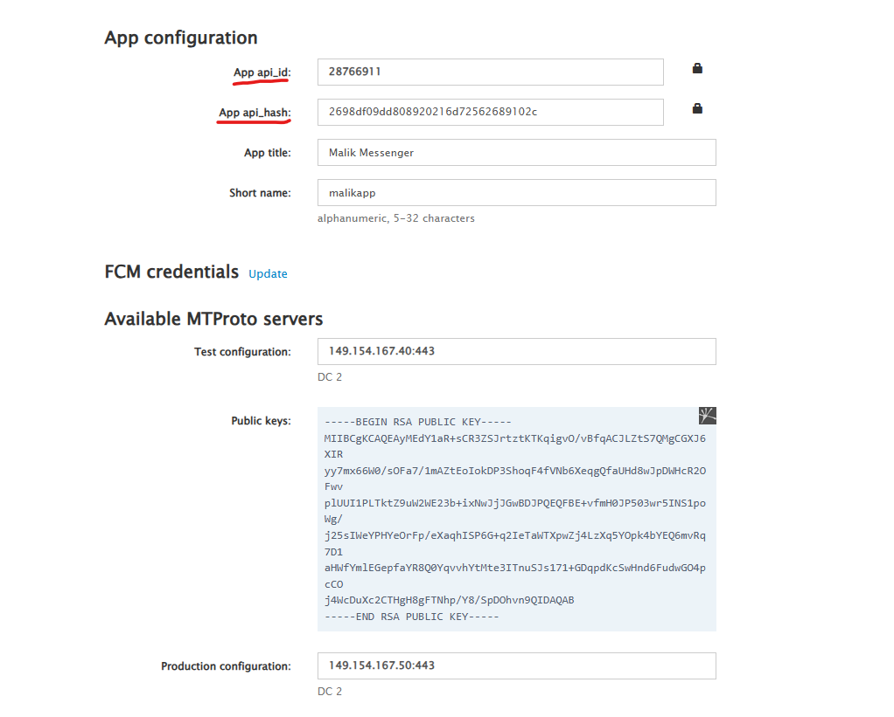

# مساعد IAAI

إضافة متصفح جوجل كروم لإدارة اختيارات مركبات IAAI والتواصل عبر واتساب وتيليجرام.

## كيفية تثبيت الإضافة

### الطريقة 1: تثبيت الإضافة في وضع المطور

1. قم بتنزيل وفك ضغط ملفات الإضافة في مجلد على جهازك
2. افتح متصفح جوجل كروم وانتقل إلى: `chrome://extensions/`
3. قم بتفعيل "وضع المطور" (Developer mode) من الزاوية العلوية اليمنى
4. انقر على زر "تحميل غير مضغوط" (Load unpacked) كما هو موضح في الصورة أدناه
5. حدد المجلد الذي يحتوي على ملفات الإضافة (المجلد الذي يحتوي على ملف `manifest.json`)
6. ستظهر الإضافة الآن في قائمة الإضافات المثبتة

## إعداد واجهة برمجة تطبيقات تيليجرام (Telegram API)

### خطوات الحصول على بيانات API تيليجرام

1. قم بزيارة موقع تيليجرام الرسمي للمطورين: [my.telegram.org](https://my.telegram.org/)
2. سجل الدخول باستخدام رقم هاتفك المسجل في تيليجرام
3. انتقل إلى "API development tools" أو "أدوات تطوير API"

### الخطوة 1: تسجيل الدخول وإدخال رقم الهاتف

أولاً، قم بزيارة موقع تيليجرام الرسمي للمطورين: [my.telegram.org](https://my.telegram.org/)

-   أدخل رقم هاتفك بالصيغة الدولية (مثال: +971XXXXXXXXX)
-   اضغط على زر "Next" للمتابعة
-   سيتم إرسال رمز التحقق إلى تطبيق تيليجرام الخاص بك
-   ملاحظة: سيتم إرسال الرمز عبر تطبيق تيليجرام وليس عبر رسالة SMS

### الخطوة 2: الوصول إلى لوحة التحكم

-   بعد تسجيل الدخول، ستظهر لك لوحة التحكم الخاصة بك
-   انقر على "API development tools" للوصول إلى أدوات التطوير
-   يمكنك أيضاً استخدام الخيارات الأخرى مثل حذف الحساب أو تسجيل الخروج

### الخطوة 3: إنشاء تطبيق وإعداد API

قم بملء النموذج بالمعلومات التالية:

-   App api_id: سيتم إنشاؤه تلقائياً (مثال: 28766911)
-   App api_hash: سيتم إنشاؤه تلقائياً

### كيفية استخدام API تيليجرام في الإضافة

1. انقر على أيقونة الإضافة في شريط المتصفح
2. انتقل إلى تبويب "تيليجرام" من شريط التنقل
3. أدخل البيانات التالية:
    - API ID: رقم معرف التطبيق الذي حصلت عليه
    - API Hash: مفتاح التشفير الخاص بالتطبيق
    - رقم الهاتف: رقم هاتفك المسجل في تيليجرام بالصيغة الدولية
4. اضغط على زر "تهيئة تيليجرام"
5. ستتلقى رمز تحقق على تطبيق تيليجرام الخاص بك
6. أدخل رمز التحقق في النافذة المنبثقة
7. بمجرد التحقق بنجاح، سيتم تفعيل الاتصال وحفظ بيانات الجلسة

### ملاحظات هامة

-   احتفظ بـ API ID و API Hash في مكان آمن ولا تشاركهما مع أحد
-   يمكنك استخدام نفس بيانات API مع عدة أجهزة
-   في حال واجهت مشاكل في الاتصال:
    -   تأكد من صحة البيانات المدخلة
    -   جرب تسجيل الخروج وإعادة الاتصال
    -   تأكد من أن رقم هاتفك نشط في تيليجرام
-   لا تقم بمشاركة رموز التحقق مع أي شخص
-   يمكنك إدارة التطبيقات المرتبطة بحسابك في أي وقت من خلال موقع my.telegram.org

## استخدام خاصية المراسلة وربط واتساب

### خطوات ربط واتساب بالإضافة

1. انقر على أيقونة الإضافة في شريط المتصفح
2. انتقل إلى تبويب "المراسلة" من شريط التنقل
3. اضغط على زر "اتصال بواتساب" في قسم "الاتصال بواتساب"
4. سيظهر رمز QR على الشاشة

### كيفية مسح رمز QR

1. افتح تطبيق واتساب على هاتفك المحمول
2. اذهب إلى الإعدادات (ثلاث نقاط) ثم "واتساب ويب" أو "الأجهزة المرتبطة"
3. اختر "ربط جهاز"
4. وجه كاميرا هاتفك نحو رمز QR الموجود في نافذة الإضافة
5. بمجرد مسح الرمز بنجاح، ستظهر حالة الاتصال "متصل"

### إرسال معلومات المركبات عبر واتساب

1. تأكد من إضافة المركبات المطلوبة إلى عربة التسوق أولاً
2. انتقل إلى تبويب "المراسلة"
3. تأكد من اتصال واتساب
4. أدخل رقم واتساب للمستلم بالصيغة الدولية (مثال: 971XXXXXXXXX) بدون + أو 00
5. اضغط على زر "تحقق" للتأكد من صحة الرقم
6. قم بمراجعة عناصر العربة في قسم "مراجعة عناصر العربة"
7. أدخل رسالة في قالب الرسالة أو استخدم الرسالة الافتراضية
8. اضغط على زر "إرسال إلى واتساب" لإرسال المعلومات

## استكشاف الأخطاء وإصلاحها

-   **إذا لم يظهر رمز QR**: اضغط على زر "تحديث" أو أعد تشغيل الإضافة
-   **إذا انقطع الاتصال بواتساب**: اضغط على "اتصال بواتساب" مرة أخرى لإعادة الاتصال
-   **إذا كانت الأزرار معطلة**: تأكد من أن العربة تحتوي على عناصر وأن واتساب متصل

## متطلبات النظام
